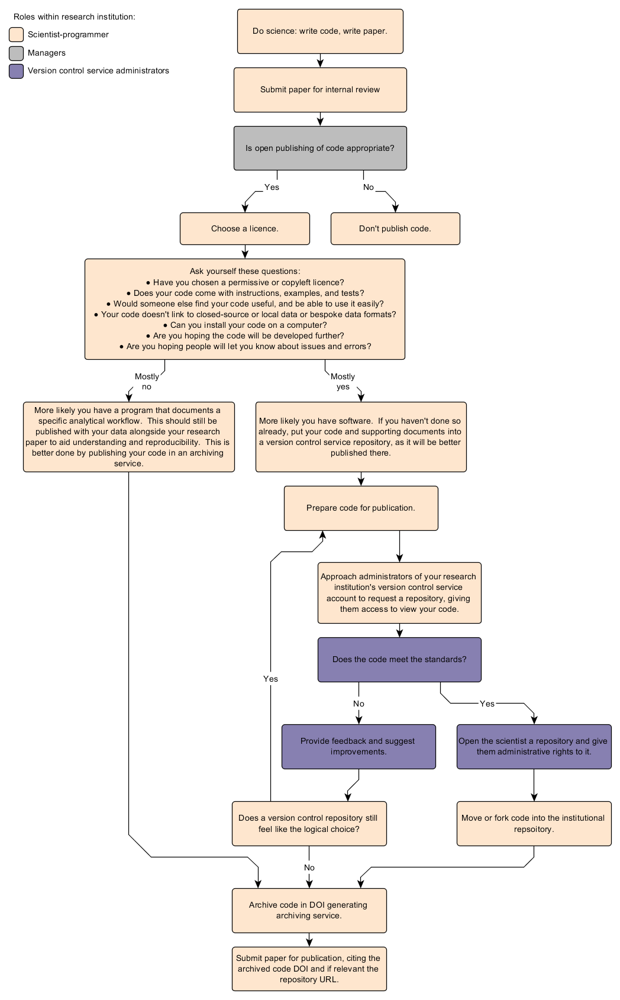

---
title: 'A research institution framework for publishing open code to enable reproducible science'

author:
  - Thomas R. Etherington
  - Ben Jolly
  - Jan Zörner
  - Nick Spencer

bibliography: paper.bib

header-includes:
  - \usepackage[left]{lineno}
  - \linenumbers
...

# Abstract

Reproducible science is greatly aided by open publishing of scientific computer code.
There are also many institutional benefits for encouraging the publication of scientific code, but there are also institutional considerations around intellectual property and risk.
We discuss questions around scientific code publishing from the perspective of a research organisation asking: who will be involved, how should code be licensed, where should code be published, how to get credit, what standards, and what costs?
In reviewing advice and evidence relevant to these questions we propose a research institution framework for publishing open scientific code to enable reproducible science.

**Keywords:** archiving, code, version control, open science, programming

# Introduction

There is evidence of a 'reproducibility crisis' in science, with few scientists able to replicate and therefore confirm the findings of other scientists [@baker-2016].
Therefore, the calls for research to be transparent and more reproducible are growing.
Two key components of transparency and reproducibility of a scientific method are (i) access to the original data sources used, and (ii) an exact description of the method provided by computer code [@nosek-2015].
When scientists analyse data or create models by programming computer code instead of navigating around graphical user interface, they not only can do more novel science faster but they also create an efficient way of providing the exact analysis method to others such that it is more easily reproduced [@baker-2017; @ince-2012].
To support this, open and citable data and scientific code is required.
However, while there has been discussion of how research institutions may support scientific data archiving and citation [@renaut-2018], we feel a similar research institution focussed discussion needs to occur for scientific code.
There are many institutional benefits for encouraging scientific code archiving and citation that include:
supporting transparency and reproducibility, preservation of effort, opportunities for collaboration, and management of intellectual property (IP) and risk.
There are also tools and advice available on best practice that can be called upon.
These come from both the formal (private) software sector and increasingly, the scientific coding and data sharing communities.
We provide a unique perspective on these issues by discussing questions around scientific code publishing from the perspective of a research institution.
In doing so we present a research institution framework for publishing scientific code that leverages community accepted tools to minimise the institutional effort required and maximise the benefits of their scientist's computer programming.

# Who will be involved?

There are two primary groups involved for institutional publishing of scientific code, scientists and managers.
Scientists need advice and assistance, including tools, to support their code management practices.
The primary needs of this group are solutions that are easy to use, access to simple guidelines, and support that doesn’t get in the way of doing their research.
They also need some advice on how to make decisions on IP, what to publish and not, how to licence code correctly, and where to store it.
Managers within an institution will be interested in bringing these topics together into a standard operating procedure that helps articulate obligations for staff.
We felt the second group was more likely to be focused at a company perspective, especially concerned with issues such as IP, risk, preservation of effort, standards, and reporting.
The important point here is that we expect that scientists will be better able to publish scientific code with the support and engagement of other members of their research institution, and as such any code publishing framework will include members of staff other than the scientist-programmer.

If we assume that all code is accompanied by a paper (either an associated research paper or a dedicated software paper), then making these decisions can most likely be supported by an existing internal pre-publication review process that most research institutions are likely to have for publication of papers.
The scientist-programmer would then submit their paper for internal review, and any intent to openly publish code could be reviewed by managers simultaneously with other considerations such as data, ethics, and IP to ensure publication decisions are appropriate.
Therefore, we do not foresee that the publishing of code should require any additional managerial workflows, other than highlighting the intention to openly publish code during an existing internal review procedure.

# How should code be licensed?

It is worth noting that with respect to licencing and IP we are focusing our discussion on publishing research code and not commercial code.
This is an important distinction as unlike commercial code for which the right to use must be purchased, much of the value in scientific code is in its openness to support the scientific method, as demonstrated by higher rates of citation for free rather than commercial software [@pan-2016].
It is also important to note that many science funders now expect that any code developed as part of a project will be made openly available.
Therefore, our starting point for discussing publishing scientific code is that it is made free and open by default, and we consider proprietary licensing to be out of scope.
Such a decision will need to be supported by the research institution which is likely to own the IP of any code [@morin-2012], but as most scientific code will have minimal value for direct commercialisation if any [@barnes-2010], this should not be problematic.
Also, as long as the code is developed carefully to ensure that it does not contain sensitive information such as embedded data, network paths, or passwords, there should not be any issues around privacy or security that would preclude open publishing.
Regardless, the scientist-programmer should still begin the process of code publishing with a discussion with their project leader about any requirements or stipulations that would prevent or require open publishing.

Choice of an appropriate software licence is of fundamental importance to code publishing as leaving code unlicensed can be hugely problematic, as it exposes a scientist who developed or uses that code to possible legal issues at a later date, and potential difficulties in controlling how the code is used [@morin-2012].
Indeed, without a licence most potential collaborators and open source participants will not reuse such code as the IP risk is too great downstream, so not attaching a licence to open code can prevent the intention of making code open so it can be reused or developed further.
It is also important to note that in our later discussion of coding standards we have taken the view that a research institution cannot guarantee code correctness, so a licence is absolutely essential to protect against any possible liability.
There are a wide variety of software licences available, and there is online guidance for choosing one [(https://choosealicense.com/)](https://choosealicense.com/).
Keys points of difference for open licences are perhaps differences between permissive licences that have no restrictions on use or copyleft licences that ensure development of the code has to be shared [@morin-2012].
Scientists may even choose to pursue bespoke licences, but in our opinion this approach is not ideal.
Developing a bespoke licence will require additional effort and legal support.
A bespoke licence may also be off-putting as potential users must be confident that they understand the licence conditions, and this will be much more likely and easy through the use of a widely recognised and accepted licence.
Ultimately the choice of the most appropriate licence is likely to be project specific, so that is a decision best made by the scientist-programmer and project leader.

# Where should code be published?

We envisage two main options for places to publish scientific code:
version control hosting services (such as [GitHub](https://github.com/), [GitLab](https://www.gitlab.com/), [Bitbucket](https://bitbucket.org/), [GNU Savannah](https://savannah.gnu.org/), etc), and archiving services (such as [Zenodo](https://zenodo.org/), [Dryad](http://www.datadryad.com/), [FigShare](https://figshare.com/), etc).

While the focus of much discussion around open code involves version control services such as GitHub, it is important to recognise that code put into these services do not necessarily have guaranteed permanence [@white-2015].
Repositories can be deleted and renamed at any time, meaning that code may become lost, or links to code broken.
Therefore, it is important that each release of code is also published in an appropriate archiving service [@white-2015].

It may also be the case that a version control repository is not the best place for code to be published.
Openness is certainly at the heart of version control repositories, but there is a very strong emphasis on facilitating development and collaboration, which relates very strongly to scientific software.
However, in an instance where a scientist has coded a computer program to analyse some data, while the code should be published alongside the data to enable reproducibility, it is unlikely that there will be any desire to develop the code further as it should remain a static documentation of the analysis underlying a scientific publication.
In these instances, simply publishing the code in an archiving service alongside the data may be the best option.
Publishing static code in a version control service would mainly serve the purpose of enabling other researchers to easily create copies of the code (clones) with the intention to improve it or adapt it to their applications.
Read-only repositories on a version control service pose a viable option to share non-changeable code as they can be copied by other users, using built-in tools cloning and forking tools of the underlying version control system, to create their own trackable code repository.

Ultimately, we don't think there is any way to clearly define which publishing route is best.
Rather we choose to pose the scientist-programmer the following series of questions that may indicate if a scientist's code is more suitable for a version control service (given the potential for further development) or an archiving service (as it represents a static analytical workflow) and then leave the scientist-programmer to decide on the best course of action.

* Have you chosen a permissive or copyleft licence?
* Does your code come with instructions, examples, and tests?
* Would someone else find your code useful, and be able to use it easily?
* Your code doesn't link to closed-source or local data or bespoke data formats?
* Can you install your code on a computer?
* Are you hoping the code will be developed further?
* Are you hoping people will let you know about issues and errors?

The more times a scientist-programmer answers yes to these questions, the more likely it is that putting the code into a version control service will be a worthwhile effort.

# How to get credit?

There is some evidence that making data open alongside a paper increases citations [@piwowar-2013] and we can easily envisage that this would be true of code as well.
Therefore, having published code openly, it would be sensible for some consideration to be given to gaining credit for this effort by being able to demonstrate impact.
We have already discussed the importance of putting releases of code into an archiving service to ensure permanence.
But putting code into an archiving service also helps with citations, as on deposit of the code an archiving service will generate a digital object identifier (DOI) that can then form the basis of software citations [@poisot-2015].
Also, as scientific community norms for citation are based on the citation of papers, software papers are often published and cited in addition to the software [@smith-2016].
However, the focus of a software paper should be in demonstrating how the software can be used for actual research, rather than documenting functionality which is best done with formatted comments (docstrings) embedded in the source code describing code segments that can be easily extracted to form a technical manual [@poisot-2015].
Software papers are a growing trend, and a list of journals publishing software papers is actively maintained by the Software Sustainability Institute [(https://www.software.ac.uk/resources/guides/which-journals-should-i-publish-my-software)](https://www.software.ac.uk/resources/guides/which-journals-should-i-publish-my-software).  Regardless of how a scientist chooses to publish code, some evidence suggests that software is more likely to be cited when information about how to cite the software is provided [@pan-2016], therefore citation instructions should be included with the published code.

# What standards?

A clear concern for any institutionally branded form of published code, is an assurance that the code has been peer-reviewed to ensure it meets some form of standard, i.e. quality standard and language-specific coding style.
How exactly code should be peer-reviewed remains an active debate, but what is agreed is that it is too large a task to expect another scientist to conduct a line-by-line review of code to verify the code is correct [@white-2015; @poisot-2015].
Institutions may also have problems in that there is the potential for staff to be using a variety of programming languages, and given language choice can be domain specific there is no guarantee that there will necessarily be another scientist within the institution that is sufficiently fluent in a specific language to conduct a review.
Institutions could consider imposing language choice to a set of official institutional languages, but this may be an overly restrictive approach that could limit scientific progress.
We would also note that there are artistic differences in the way code is written and that there is no single best way to program [@knuth-1974].
Therefore, it will be important to recognise and accept different styles of coding, and avoid getting bogged down in discussions (or arguments!) about how the code has been written.

We believe that a pragmatic review process should focus of checking that the code is structured and presented in a way such that someone can, if they wanted to, delve into the code to understand and check exactly what the code is doing, and potentially then correct or develop the code further.
Essentially our view is that it is better to have code made open such that errors are more likely to be found and fixed.
Publishing erroneous code is clearly not ideal, but we consider it preferable to the alternative where the erroneous code stays on a scientist's computer where it may be applied many times to produce incorrect science.
Also, there is evidence that suggests making data underlying studies open reduces errors by encouraging greater scientific rigour [@wicherts-2011], and we can imagine that the same may well be true of scientific code, and that working in an open manner will encourage programmers to aim for higher standards [@easterbrook-2014].

While accepting that a line-by-line review of code to verify correctness is unfeasible, research institutions will clearly want to uphold some standards for code published under an institutional banner.
There are well recognised best practices [@wilson-2014], but given the lack of formal training scientists have received in computer programming [@merali-2010], setting a best practice standard may well be perceived by the average scientist as an impossible task.
Hence, demanding best practices may result in a counter-productive result of scientists choosing not to engage at all with coding standards.
Therefore, we would recommend focusing more on good enough practices [@wilson-2017], and recommend the following minimum standards:

* README file (including: project overview, installation requirements, setup instructions, dependencies),
* LICENSE file (permissive or copyleft),
* citation instructions (either included in the README or as a citation file),
* example data and script,
* documentation embedded within functions,
* good coding practice (such as: commented, indented, white space, logical variable names, function definition),
* sensitive information removed (including: usernames, passwords, application programming interface (API) keys, full paths to files on network drives),
* version control history removed.

Note that where code relies on hard-coded credentials such as usernames, passwords, or API keys, it is best practice to place these in a separate file (commonly named '.credentials') that is referenced by the rest of the code but excluded from the version control system.
In this case it is a good idea to include a note in your README explaining the expected format, or even an 'example' credentials file, to make it easier for users to recreate it on their own system.
Also, while removing the version control history can also help with issues of security, we believe that in the context of publishing the first release of code is probably best done without the underlying development history which can often be complex, tangential, and possibly irrelevant to the first release.

Software journals such as the Journal of Open Software Journal [@smith-2018] can impose greater standards such unit-testing and automated dependency checks as they are not obliged to accept code that is submitted and so the scope can be quite focussed and hence the standards very high.
In contrast, a research institution may often have a very broad scope as there may be a variety of coding activities within the organisation, and there is a responsibility to provide a code archiving service and to facilitate maximum uptake by staff.
Therefore, while an institutional repository may ensure a basic standard, if a scientist wishes to achieve greater evidence for the standard of their code, then we would recommend engaging with external processes and publish the code more formally through the publication of a dedicated software paper that is likely to demand higher standards of coding.

# What costs?

Depending on the solution that is required for individual research institutions, there may be ongoing financial costs to purchase access to (or host and maintain) a version control hosting and archiving service.
For institutions beginning to explore these options there are possibilities to make use of free service options.
For example, at the time of writing, GitHub provide free team accounts as long as all code is made open, and free individual accounts that support private repositories with up to three collaborators.
Scientist-programmers could therefore use a free private repository for version control of project code without exposing their development process (and possible intellectual property) publicly, and then use the research institution's free team account to openly publish the code (or parts thereof).
Similar options are available from other providers such as BitBucket, or if versional control is not required then archiving services such as Zenodo also provide a free option for archiving code. 
Given these options exist, we do not see financial cost as an obstacle for research institutions to start engaging with these issues around code publishing.

What may be more of an obstacle is recognition that there can be significant time costs to making code sharable and reusable, over and above that required to develop well-structured code to answer a science question.
This means that careful consideration needs to be given to justify the amount of effort that would be required to produce a well-documented and thoroughly-tested software package which is useful to others.
Where projects are expected or required to openly publish reusable code the cost of staff time to do this should be acknowledged, in both the project budget and time-line.
However, given the benefits of publishing code, we do not necessarily see this burden as being too arduous, especially if institutions are willing to invest in hiring staff or training scientists to support this activity.
The Research Software Engineer (RSE) is a relatively new role in a research institute which describes someone who specialises in the production and publishing of scientific code and software.
This is typically (though not necessarily) a 'science support' type of role, where RSEs are typically hired to both write code for others as well as boost the quality of others code via training and/or collaboration on a given project.
Enabling scientists to publish code, either assisted by an RSE or through upskilling, facilitates more transparent and thus more credible research with a more rapid impact on the science community which translates to both higher scientific quality and more successful funding in the long-term, offsetting initial costs.

# A framework for publishing

Clearly from our discussion establishing a research institution framework for publishing of open and good enough scientific code will require effort from both the scientists and managers.
However, we expect that the advantages:

* enables reporting to funders,
* better outreach for the scientist and the institution,
* stimulates collaboration with other researchers,
* quality control and transparency of science,
* greater visibility of code projects compared to personal accounts,
* provides repository exemplars useful for other scientists,
* other research institutions are already doing this,
* provides long-term support or at least access of published code,
* access and continuity of institutional knowledge if the person responsible for a repository leaves the research institution;

will significantly outnumber the disadvantages:

* services such as version control hosting and code review procedures need to be administered,
* scientists like to have freedom and may prefer to use another platform or like to publish code personally,
* ongoing institutional costs associated with version control hosting and archiving services,
* increased project costs to factor in staff time to make open code well documented and supported,
* accounts and repositories could become abandoned if nobody is using them.

As this will be a new initiative for many research institutions, we have summarised a framework that outlines a potential workflow for the scientists and managers that will need to be involved in publishing scientific code (Figure 1).
As has been recognised with institutional data archiving, a supportive corporate environment and training is will be important for making such an initiative succeed [@renaut-2018].
The same will be true of expecting higher standards of computer programming publishing from research scientists, and while it may be challenging for research institutions to provide training, there are initiatives such as Software and Data Carpentry that can support this [@baker-2017].

# Acknowledgements

This research was funded by internal investment by Manaaki Whenua –- Landcare Research.

# References
